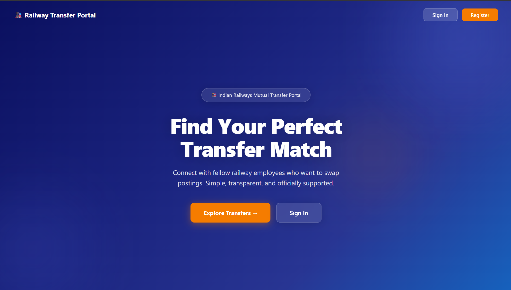
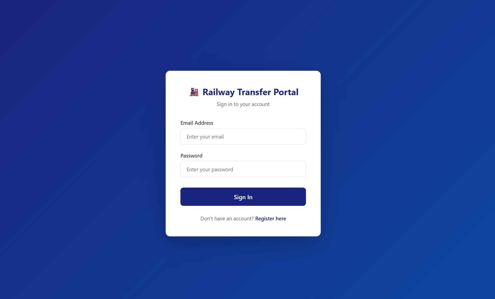
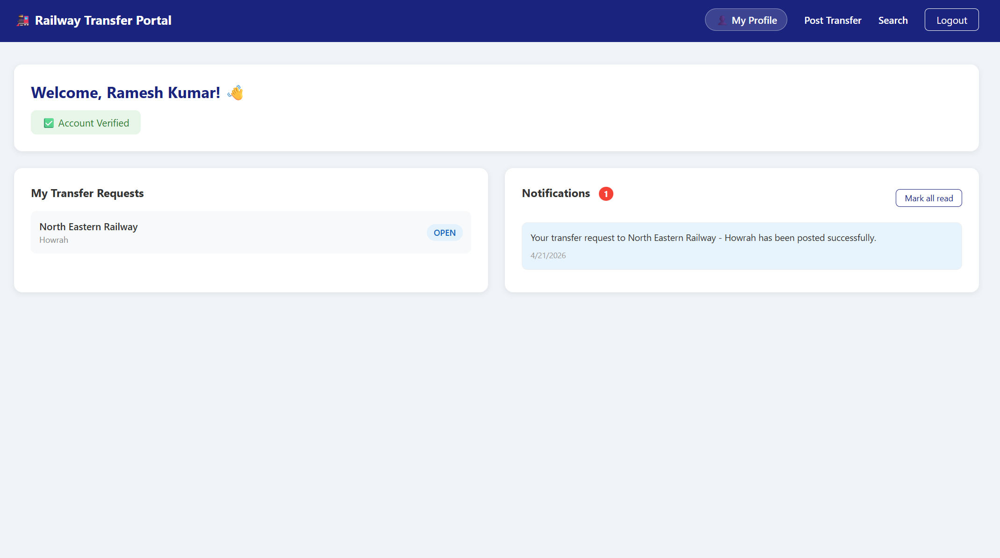
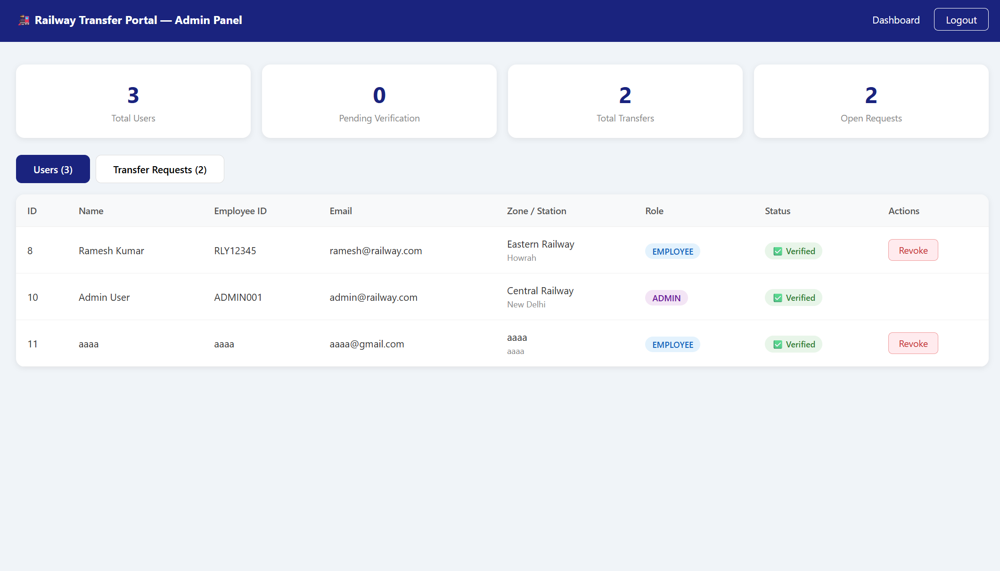
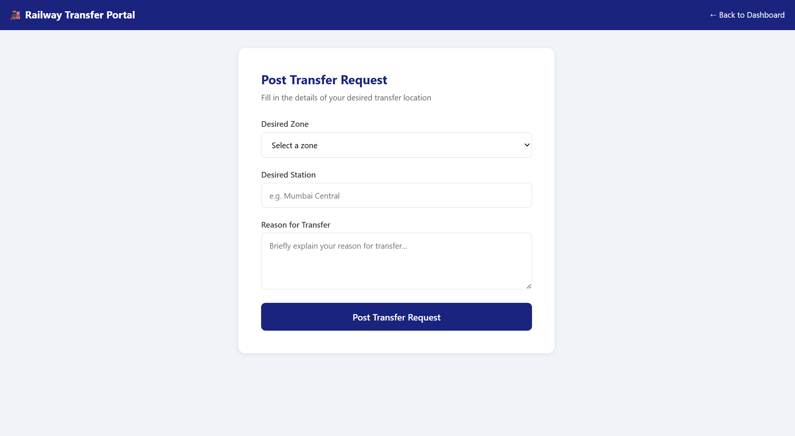
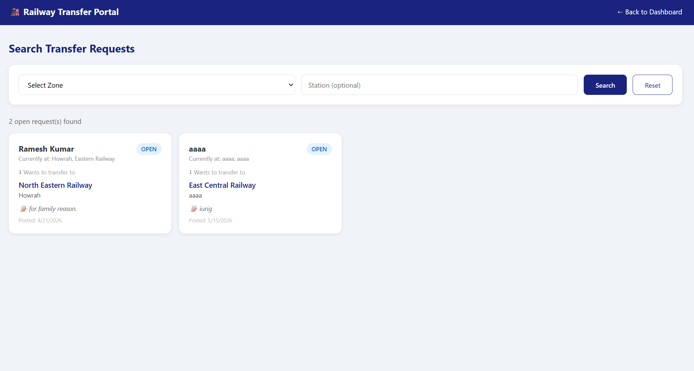
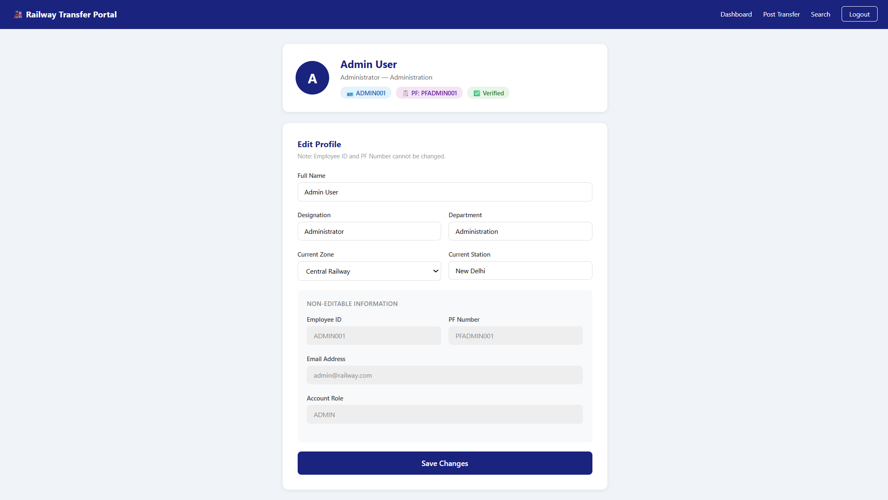

# 🚂 Railway Staff Mutual Transfer Portal

A full-stack web application that helps Indian Railway employees find mutual transfer matches across zones and stations. Built with Spring Boot (backend) and React (frontend).

---

## 🌐 Live Demo

- **Frontend:** [railway-transfer-frontend.vercel.app](https://railway-transfer-frontend.vercel.app)
- **Backend:** Spring Boot REST API

---

## 📸 Screenshots

### Home Page


### Login Page


### Dashboard


### Admin Panel


### Post Transfer Request


### Search Transfers


### Profile Page


---

## ✨ Features

### Employee Features
- ✅ Register with Employee ID and PF Number
- ✅ Secure login with JWT authentication
- ✅ Post mutual transfer requests
- ✅ Search transfer requests by zone and station
- ✅ Get matched with compatible transfer requests
- ✅ Real-time in-app notifications
- ✅ Email notifications via Gmail SMTP
- ✅ Edit profile (name, designation, zone, station)

### Admin Features
- ✅ Verify employee identity using Employee ID and PF Number
- ✅ View all registered users
- ✅ Approve or close transfer requests
- ✅ Full admin dashboard with stats

---

## 🛠️ Tech Stack

### Backend
| Technology | Purpose |
|---|---|
| Java 21 | Programming Language |
| Spring Boot 3.4.3 | Backend Framework |
| Spring Security | Authentication & Authorization |
| JWT (jjwt 0.12.3) | Token-based Authentication |
| Spring Data JPA | Database ORM |
| Hibernate | JPA Implementation |
| MySQL | Database |
| Spring Mail | Email Notifications |
| Maven | Build Tool |

### Frontend
| Technology | Purpose |
|---|---|
| React 18 | Frontend Framework |
| React Router | Navigation |
| Axios | HTTP Client |
| CSS-in-JS | Styling |

### Deployment
| Platform | Purpose |
|---|---|
| Vercel | Frontend Hosting |
| Railway | Backend Hosting |
| MySQL | Database |

---

## 🏗️ Project Structure

railway-transfer-portal-web-application-/
│
├── backend/                          ← Spring Boot
│   └── src/main/java/com/railway/transfer/
│       ├── config/
│       │   └── SecurityConfig.java
│       ├── controller/
│       │   ├── AuthController.java
│       │   ├── TransferController.java
│       │   ├── AdminController.java
│       │   ├── NotificationController.java
│       │   └── UserController.java
│       ├── service/
│       │   ├── AuthService.java
│       │   ├── TransferService.java
│       │   ├── AdminService.java
│       │   ├── NotificationService.java
│       │   ├── UserService.java
│       │   ├── EmailService.java
│       │   ├── JwtUtil.java
│       │   └── JwtAuthFilter.java
│       ├── repository/
│       │   ├── UserRepository.java
│       │   ├── TransferRequestRepository.java
│       │   └── NotificationRepository.java
│       └── model/
│           ├── User.java
│           ├── TransferRequest.java
│           ├── Notification.java
│           ├── RegisterRequest.java
│           ├── LoginRequest.java
│           ├── AuthResponse.java
│           ├── TransferRequestDTO.java
│           └── UpdateProfileRequest.java
│
└── frontend/                         ← React
└── src/
├── api/
│   └── axios.js
├── pages/
│   ├── Home.jsx
│   ├── Login.jsx
│   ├── Register.jsx
│   ├── Dashboard.jsx
│   ├── PostTransfer.jsx
│   ├── SearchTransfer.jsx
│   ├── Profile.jsx
│   └── AdminPanel.jsx
└── App.js

---

## 🗄️ Database Schema

### Users Table
| Column | Type | Description |
|---|---|---|
| id | BIGINT | Primary Key |
| employee_id | VARCHAR | Unique Railway Employee ID |
| pf_number | VARCHAR | Provident Fund Number |
| name | VARCHAR | Full Name |
| email | VARCHAR | Email Address |
| password | VARCHAR | BCrypt Hashed Password |
| designation | VARCHAR | Job Designation |
| department | VARCHAR | Department |
| current_zone | VARCHAR | Current Railway Zone |
| current_station | VARCHAR | Current Station |
| verified | BOOLEAN | Admin Verification Status |
| role | ENUM | EMPLOYEE or ADMIN |
| created_at | DATETIME | Registration Date |

### Transfer Requests Table
| Column | Type | Description |
|---|---|---|
| id | BIGINT | Primary Key |
| user_id | BIGINT | Foreign Key to Users |
| desired_zone | VARCHAR | Desired Transfer Zone |
| desired_station | VARCHAR | Desired Transfer Station |
| reason | TEXT | Reason for Transfer |
| status | ENUM | OPEN, MATCHED, APPROVED, CLOSED |
| created_at | DATETIME | Request Date |

### Notifications Table
| Column | Type | Description |
|---|---|---|
| id | BIGINT | Primary Key |
| user_id | BIGINT | Foreign Key to Users |
| message | TEXT | Notification Message |
| is_read | BOOLEAN | Read Status |
| created_at | DATETIME | Notification Date |

---

## 🔌 API Endpoints

### Auth
| Method | Endpoint | Description | Auth |
|---|---|---|---|
| POST | `/api/auth/register` | Register new employee | Public |
| POST | `/api/auth/login` | Login and get JWT token | Public |

### Transfer
| Method | Endpoint | Description | Auth |
|---|---|---|---|
| POST | `/api/transfer/post` | Post transfer request | Employee |
| GET | `/api/transfer/my-requests` | Get my requests | Employee |
| GET | `/api/transfer/all` | Get all open requests | Employee |
| GET | `/api/transfer/search` | Search by zone/station | Employee |
| PUT | `/api/transfer/close/{id}` | Close a request | Employee |

### Admin
| Method | Endpoint | Description | Auth |
|---|---|---|---|
| GET | `/api/admin/all-users` | Get all users | Admin |
| GET | `/api/admin/unverified-users` | Get unverified users | Admin |
| PUT | `/api/admin/verify/{id}` | Verify a user | Admin |
| PUT | `/api/admin/reject/{id}` | Reject a user | Admin |
| GET | `/api/admin/all-transfers` | Get all transfers | Admin |
| PUT | `/api/admin/approve-transfer/{id}` | Approve transfer | Admin |
| PUT | `/api/admin/close-transfer/{id}` | Close transfer | Admin |

### Notifications
| Method | Endpoint | Description | Auth |
|---|---|---|---|
| GET | `/api/notifications` | Get all notifications | Employee |
| GET | `/api/notifications/unread` | Get unread notifications | Employee |
| GET | `/api/notifications/count` | Get unread count | Employee |
| PUT | `/api/notifications/read/{id}` | Mark as read | Employee |
| PUT | `/api/notifications/read-all` | Mark all as read | Employee |

### User Profile
| Method | Endpoint | Description | Auth |
|---|---|---|---|
| GET | `/api/user/profile` | Get profile | Employee |
| PUT | `/api/user/profile` | Update profile | Employee |

---

## 🚀 How to Run Locally

### Prerequisites
- Java 21
- MySQL 8.0+
- Node.js 18+
- Maven

### Backend Setup

1. Clone the repository:
```bash
git clone https://github.com/jyotixcodes/railway-transfer-portal-web-application-.git
cd railway-transfer-portal-web-application-/backend
```

2. Create `src/main/resources/application.properties`:
```properties
spring.application.name=railway-transfer-portal
server.port=8080

spring.datasource.url=jdbc:mysql://localhost:3306/railway_transfer_db?createDatabaseIfNotExist=true
spring.datasource.username=root
spring.datasource.password=YOUR_MYSQL_PASSWORD
spring.datasource.driver-class-name=com.mysql.cj.jdbc.Driver

spring.jpa.hibernate.ddl-auto=update
spring.jpa.show-sql=true

jwt.secret=railway_super_secret_key
jwt.expiration=86400000

spring.mail.host=smtp.gmail.com
spring.mail.port=587
spring.mail.username=YOUR_GMAIL
spring.mail.password=YOUR_APP_PASSWORD
spring.mail.properties.mail.smtp.auth=true
spring.mail.properties.mail.smtp.starttls.enable=true
```

3. Run the backend:
```bash
mvn spring-boot:run
```

Backend runs at `http://localhost:8080`

### Frontend Setup

1. Navigate to frontend:
```bash
cd railway-transfer-portal-web-application-/frontend
```

2. Install dependencies:
```bash
npm install
```

3. Update `src/api/axios.js`:
```javascript
const api = axios.create({
  baseURL: 'http://localhost:8080',
});
```

4. Start the frontend:
```bash
npm start
```

Frontend runs at `http://localhost:3000`

### Create Admin User

Run this SQL in MySQL Workbench after starting the backend:

```sql
USE railway_transfer_db;
INSERT INTO users (
    employee_id, pf_number, name, email, password,
    designation, department, current_zone, current_station,
    verified, role, created_at
) VALUES (
    'ADMIN001', 'PFADMIN001', 'Admin User',
    'admin@railway.com',
    '$2a$10$YOUR_BCRYPT_HASH',
    'Administrator', 'Administration',
    'Central Railway', 'New Delhi',
    1, 'ADMIN', NOW()
);
```

---

## 🔐 Security Features

- **BCrypt** password hashing
- **JWT** token authentication
- **Role-based** access control (EMPLOYEE / ADMIN)
- **CORS** configuration for frontend
- Stateless session management
- Employee identity verification by admin

---

## 👨‍💻 Developer

**Jyoti** — Full Stack Developer
- GitHub: [@jyotixcodes](https://github.com/jyotixcodes)

---

## 📄 License

This project is for educational purposes.